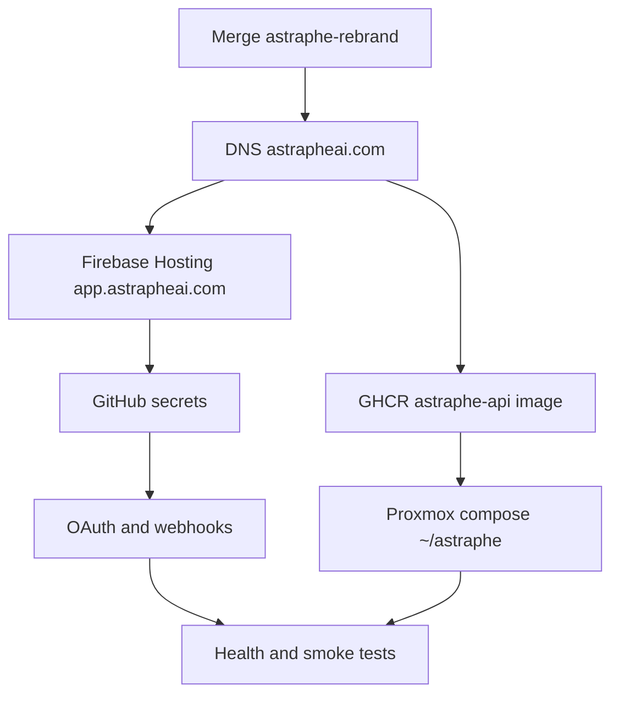

# Astraphe Rebrand — Operations Checklist

Post-rebrand tasks **outside the codebase**: infrastructure, third-party consoles, secrets, and local dev relaunch. The in-repo string/asset rename lives on branch `astraphe-rebrand` (or `main` after merge).

**Related docs:** [SETUP.md](./SETUP.md) (local dev), [DEPLOYMENT.md](./DEPLOYMENT.md) (CI/CD), [GETTING_STARTED.md](./GETTING_STARTED.md) (detailed local stack).

**Not covered here:** [backend/cloudbuild.yaml](../backend/cloudbuild.yaml) / Google Cloud Run — legacy pipeline; production API runs on **Proxmox Docker**, not Cloud Run.

---

## Supabase: self-hosted URL and internal ref

Production Supabase (Auth, REST, Storage, Realtime) is **self-hosted on Proxmox**, exposed publicly at:

```text
https://supabase.astraphe.com
```

| Audience | `SUPABASE_URL` / `VITE_SUPABASE_URL` |
|----------|--------------------------------------|
| Mobile app, web app (browser) | `https://supabase.astraphe.com` |
| Backend API container on Proxmox | `http://host.docker.internal:8001` (Kong on the Docker host) **or** `https://supabase.astraphe.com` if the container can reach it via TLS |

See [DEPLOYMENT.md](./DEPLOYMENT.md) for the internal Kong hostname pattern. Local dev still uses `http://127.0.0.1:54321` via Supabase CLI.

**Internal project ref (do not rename):** `wtwzzjjsbkungugtcyte` — this is the cluster/database identity in dumps, JWT `ref` claims, and legacy references. You are **not** migrating to Supabase Cloud (`*.supabase.co`); point all new env vars at `supabase.astraphe.com` instead.

Keep existing **anon** and **service_role** JWT keys unless you rotate them in your self-hosted stack. Update **Auth redirect URLs**, GoTrue `SITE_URL`, Kong routes, and email template copy for the new domain.

---

## 1. In-repo work (codebase)

- [ ] Merge `astraphe-rebrand` → `main` (or confirm already merged)
- [ ] Commit any remaining rebrand follow-ups (e.g. icon generation under `mobile/static/`, `mobile/scripts/generate-pwa-icons.mjs`, `mobile/src/app.html`)
- [ ] Run verification: `rg -i astrape` — expect only `.gitignore` legacy Firebase patterns and **migration filenames** (filenames are intentionally unchanged)

Branch history (reference):

| Commit area | Contents |
|-------------|----------|
| Mobile | Capacitor, iOS, Svelte, Tailwind, logos, PWA |
| Backend | Config, prompts, services, tests |
| Supabase | `config.toml`, templates, migration SQL **content** |
| CI / infra | GitHub Actions, `.gitignore`, billing killswitch |
| Docs / rules | README, `docs/**`, Cursor rules |

---

## 2. GitHub repository

Current remote (verify): `git@github.com:sbalbale/astrape-ai-coach.git`

- [ ] GitHub → **Settings → General → Repository name** → e.g. `astraphe-ai-coach`
- [ ] Update local remote:
  ```bash
  git remote set-url origin git@github.com:sbalbale/astraphe-ai-coach.git
  ```
- [ ] Update clone URLs in README, release notes, and any external links
- [ ] Re-point local workspace folder name on disk if desired (optional; does not affect git)

---

## 3. GitHub Actions secrets

| Secret | Used in | Action |
|--------|---------|--------|
| `FIREBASE_SERVICE_ACCOUNT_ASTRAPHE_AI_COACH` | [firebase-hosting-merge.yml](../.github/workflows/firebase-hosting-merge.yml), [firebase-hosting-pull-request.yml](../.github/workflows/firebase-hosting-pull-request.yml) | Create from Firebase service account JSON (or rename old secret) |
| `VITE_API_URL` | Firebase workflows | `https://api.astrapheai.com` |
| `VITE_SUPABASE_URL` | Firebase workflows | `https://supabase.astraphe.com` |
| `VITE_SUPABASE_KEY` | Firebase workflows | Self-hosted Supabase **anon** key (unchanged unless rotated) |
| `VITE_VAPID_PUBLIC_KEY` | Firebase workflows | Must match backend `VAPID_PUBLIC_KEY` |
| `CF_ACCESS_CLIENT_ID` | [deploy.yml](../.github/workflows/deploy.yml) | Unchanged unless Cloudflare app renamed |
| `CF_ACCESS_CLIENT_SECRET` | deploy.yml | Unchanged unless Cloudflare app renamed |
| `PROXMOX_SSH_KEY` | deploy.yml | Unchanged |
| `SUPABASE_DB_PASSWORD` | deploy.yml migrate job | Must match `POSTGRES_PASSWORD` in `~/astraphe/supabase/docker/.env` |

`GITHUB_TOKEN` is automatic for GHCR pushes to `ghcr.io/sbalbale/astraphe-api`.

- [ ] All secrets above verified or created
- [ ] First push to `main` after merge builds and pushes `ghcr.io/sbalbale/astraphe-api:latest`

---

## 4. DNS and domains

Code references: CORS in [backend/app/main.py](../backend/app/main.py), OAuth return hosts in [backend/app/routers/sync.py](../backend/app/routers/sync.py).

| Host | Purpose |
|------|---------|
| `supabase.astraphe.com` | Self-hosted Supabase (Kong → Auth / REST / Storage / Realtime) |
| `app.astrapheai.com` | Svelte web app (Firebase Hosting) |
| `api.astrapheai.com` | FastAPI on Proxmox |
| `ssh.astrapheai.com` | Cloudflare Access SSH (deploy workflow) |
| `astrapheai.com` | Marketing / waitlist — **do not break** |

Until custom domain is wired, Firebase also serves:

- `astraphe-ai-coach.web.app`
- `astraphe-ai-coach.firebaseapp.com`

- [ ] DNS A/CNAME records for `supabase.`, `app.`, `api.` (and `ssh.` if used)
- [ ] TLS on `supabase.astraphe.com` terminates correctly to Kong (or your reverse proxy)
- [ ] TLS certificates valid on all public hosts
- [ ] `astrapheai.com` waitlist unchanged

---

## 5. Proxmox / Docker (production)

**The production compose file is not in this repo.** It lives on the Proxmox host (documented paths: `~/astraphe`, repo clone at `~/astraphe/repo`). See [DEPLOYMENT.md](./DEPLOYMENT.md), [REDIS.md](./REDIS.md).

Repo root [docker-compose.yml](../docker-compose.yml) is **local Redis only** — not the production API stack.

On the server:

- [ ] Rename deploy directory `~/astrape` → `~/astraphe` (or add symlink `astrape` → `astraphe`)
- [ ] Update compose service names: `astrape-api` → `astraphe-api`, `astrape-redis` → `astraphe-redis`
- [ ] Image: `ghcr.io/sbalbale/astraphe-api:latest`
- [ ] Environment on API container:
  - `APP_BASE_URL=https://api.astrapheai.com`
  - `SUPABASE_URL=http://host.docker.internal:8001` (recommended on Proxmox) or `https://supabase.astraphe.com`
  - `SUPABASE_KEY` / `SUPABASE_SERVICE_ROLE_KEY` — self-hosted keys (not `*.supabase.co`)
  - `REDIS_URL=redis://astraphe-redis:6379`
  - `MOBILE_DEEP_LINK_SCHEME=astraphe` (if set explicitly)
  - All integration secrets from [backend/.env.example](../backend/.env.example)
- [ ] `docker compose pull astraphe-api && docker compose up -d astraphe-api`
- [ ] Confirm email templates at `~/astraphe/supabase/templates/` (CI copies from repo on deploy)

---

## 6. Firebase

Config in repo: [mobile/.firebaserc](../mobile/.firebaserc) → `"default": "astraphe-ai-coach"`, [mobile/firebase.json](../mobile/firebase.json).

**Option A — Rename existing Firebase/GCP project** (if Google allows):

- [ ] Rename project to `astraphe-ai-coach`
- [ ] Regenerate service account → GitHub secret `FIREBASE_SERVICE_ACCOUNT_ASTRAPHE_AI_COACH`

**Option B — New Firebase project** (often simpler):

- [ ] Create project `astraphe-ai-coach`
- [ ] Update `.firebaserc` and download new service account JSON → GitHub secret
- [ ] Re-link Hosting custom domain `app.astrapheai.com`

**Hosting & push:**

- [ ] Connect `app.astrapheai.com` to Firebase Hosting
- [ ] Merge to `main` triggers [firebase-hosting-merge.yml](../.github/workflows/firebase-hosting-merge.yml)

**iOS (FCM):**

- [ ] Firebase Console → add/update iOS app with bundle ID `com.astraphe.coach` ([capacitor.config.ts](../mobile/capacitor.config.ts))
- [ ] Production `FCM_SERVICE_ACCOUNT_JSON` in backend env matches this Firebase project

---

## 7. Google Gemini / AI Studio

- [ ] `GEMINI_API_KEY` — no rename required; same key works. Optionally rotate and update all envs.
- [ ] Key restrictions (Google AI Studio / GCP): allow `api.astrapheai.com`, `app.astrapheai.com`, `localhost` as needed
- [ ] Backend env (see [backend/.env.example](../backend/.env.example)):
  - `GEMINI_MODEL`
  - `GEMINI_FALLBACK_MODEL`
  - `GEMINI_ANALYSIS_MODEL`
  - `GEMINI_EMBEDDING_MODEL`
- [ ] **GCP bucket (optional):** `GCP_PROJECT_ID` / `GCP_BUCKET_NAME` only if using GCS for coach document uploads ([file_parser.py](../backend/app/services/file_parser.py)). Activity streams use **Supabase Storage** (`activity-streams`), not GCS.
- [ ] If GCP billing project renamed: update [infrastructure/billing-killswitch/main.py](../infrastructure/billing-killswitch/main.py) `PROJECT_ID`

---

## 8. Resend

See [aidocs/resend-integration.md](../aidocs/resend-integration.md).

- [ ] Verify sending domain `astrapheai.com` (SPF, DKIM, DMARC in Resend dashboard)
- [ ] Create or rename audience segment **Astraphe Marketing** → copy `RESEND_AUDIENCE_ID` into backend env
- [ ] `RESEND_API_KEY` — unchanged unless rotating
- [ ] Align transactional addresses: `noreply@astrapheai.com`, `support@astrapheai.com`
- [ ] `VAPID_SUBJECT=mailto:support@astrapheai.com` (or your chosen mailbox) in production

---

## 9. Supabase (self-hosted on Proxmox)

Public URL: **`https://supabase.astraphe.com`**

- [ ] **Do not** rename internal project ref `wtwzzjjsbkungugtcyte` (DB identity / JWT ref)
- [ ] DNS + TLS: `supabase.astraphe.com` → reverse proxy → **supabase-kong** (or equivalent)
- [ ] Self-hosted Auth (GoTrue) **SITE_URL** and redirect allowlist:
  - `https://app.astrapheai.com`
  - `https://supabase.astraphe.com`
  - `http://localhost:5173` (local frontend)
  - `astraphe://` (mobile deep links)
- [ ] Kong / API gateway routes serve REST, Auth, and Storage under `https://supabase.astraphe.com`
- [ ] Email templates: deploy via CI to `~/astraphe/supabase/templates/` on Proxmox; ensure GoTrue loads [confirm.html](../supabase/templates/confirm.html) and [recovery.html](../supabase/templates/recovery.html)
- [ ] `backend/.env` / `backend/.env.prod`: `SUPABASE_URL` for production (see table at top of doc)
- [ ] `mobile/.env` / GitHub `VITE_SUPABASE_URL`: `https://supabase.astraphe.com`
- [ ] Local CLI [supabase/config.toml](../supabase/config.toml) `project_id = "astraphe-ai-coach"` is a **local dev label only** (`npx supabase start` → `127.0.0.1:54321`)

---

## 10. OAuth and webhooks (third-party consoles)

Base API URL: `https://api.astrapheai.com`

| Provider | Redirect / callback | Webhook |
|----------|---------------------|---------|
| WHOOP | `GET /v1/sync/oauth/whoop/callback` | `POST /v1/sync/whoop/webhook` |
| Strava | OAuth app domain = `api.astrapheai.com` | `GET/POST /v1/sync/strava/webhook` |
| Garmin | Per Garmin developer portal | Per Garmin portal |

Deep links (mobile): `astraphe://connected`, `astraphe://auth/*` — [native.ts](../mobile/src/lib/native.ts), [redirectUrl.ts](../mobile/src/lib/utils/redirectUrl.ts).

- [ ] WHOOP Developer Dashboard: redirect URI + webhook URL updated
- [ ] Strava API settings: callback domain; re-register webhook subscription if callback URL changed ([STRAVA_INTEGRATION.md](./STRAVA_INTEGRATION.md))
- [ ] Garmin Connect app settings updated
- [ ] WHOOP / Strava / Garmin secrets unchanged in env unless rotating

**Local OAuth testing:** expose backend with ngrok or Cloudflare Tunnel; set `APP_BASE_URL` to the public URL temporarily.

---

## 11. Apple / Capacitor (iOS)

- [ ] Apple Developer → new App ID `com.astraphe.coach` ([capacitor.config.ts](../mobile/capacitor.config.ts), [project.pbxproj](../mobile/ios/App/App.xcodeproj/project.pbxproj))
- [ ] URL scheme `astraphe` in [Info.plist](../mobile/ios/App/App/Info.plist)
- [ ] Provisioning profiles / signing updated
- [ ] `pnpm run build && npx cap sync ios` → TestFlight
- [ ] Note: `com.astrape.coach` installs are a **different** app; users must reinstall for the new bundle ID

---

## 12. Relaunch backend locally

Full detail: [SETUP.md](./SETUP.md), [GETTING_STARTED.md](./GETTING_STARTED.md).

```bash
# 1. Supabase
npx supabase start
npx supabase status          # copy API URL + keys
npx supabase db push

# 2. Redis (optional but matches prod cache/rate limits)
docker compose up -d redis   # from repo root

# 3. Backend env
cp backend/.env.example backend/.env
# Edit: SUPABASE_URL=http://127.0.0.1:54321, SUPABASE_KEY, SUPABASE_SERVICE_ROLE_KEY,
#       GEMINI_API_KEY, REDIS_URL=redis://127.0.0.1:6379

# 4. Backend
cd backend
python -m venv .venv
# Windows: .\.venv\Scripts\Activate.ps1
# macOS/Linux: source .venv/bin/activate
pip install -r requirements.txt
uvicorn app.main:app --reload --port 8000
```

```bash
# 5. Health check
curl http://localhost:8000/health
# Expect: "service": "ASTRAPHE API", redis/supabase connected
```

```bash
# 6. Mobile
cd mobile
cp .env.example .env
# VITE_SUPABASE_URL=http://127.0.0.1:54321
# VITE_SUPABASE_KEY=<anon key>
# VITE_API_URL=http://localhost:8000
pnpm install
pnpm dev
```

Checklist:

- [ ] Supabase running; migrations applied
- [ ] `backend/.env` filled from `supabase status`
- [ ] `GEMINI_API_KEY` set before testing coach chat
- [ ] `/health` returns healthy
- [ ] `mobile/.env` points at local API and Supabase
- [ ] Frontend loads at `http://localhost:5173`

**Troubleshooting:**

- Redis missing → rate limits use in-memory fallback; set `REDIS_URL` for prod-like behavior
- Coach errors → verify `GEMINI_API_KEY` and model names in `.env`
- OAuth locally → tunnel + update `APP_BASE_URL` and provider redirect URIs to tunnel URL

---

## 13. Verification

- [ ] `rg -i astrape` in repo — only `.gitignore` + migration **filenames**
- [ ] `curl http://localhost:8000/health` → `"service": "ASTRAPHE API"`
- [ ] `curl https://api.astrapheai.com/health` after production deploy
- [ ] Firebase Hosting deploy succeeds (check Actions log)
- [ ] Proxmox: `docker compose ps` shows `astraphe-api` healthy
- [ ] Sign in on `app.astrapheai.com` (or `.web.app` staging URL)
- [ ] WHOOP or Strava connect flow completes; deep link `astraphe://connected` opens app
- [ ] Privacy page marketing toggle syncs to Resend (check Resend audience)

---

## 14. Optional / defer

- [ ] GHCR package description / visibility for `astraphe-api`
- [ ] Archive or annotate stale Cloud Run content in [prod-deployment-2026-05-20.md](./prod-deployment-2026-05-20.md)
- [ ] Regenerate PWA icons after SVG changes: `cd mobile && pnpm icons`
- [ ] Rename local folder `astrape-ai-coach` on disk

---

## Dependency overview



---

*Last updated for the Astrape → Astraphe rebrand. Code references use `astraphe` naming; migration SQL **filenames** may still contain `astrape` for Supabase migration history.*
