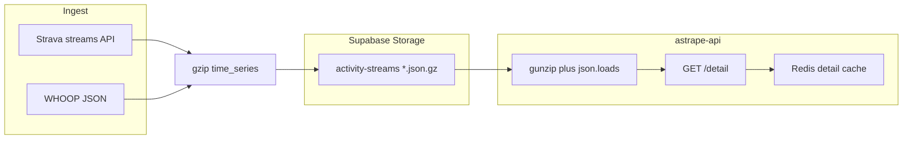

# Stream storage migration (self-hosted)

Move full-fidelity activity stream data from Postgres JSONB to Supabase Storage as **gzip-compressed JSON** blobs. **No downsampling** — preserve every sample Strava/WHOOP/HealthKit provide (typically 1 Hz for Strava streams).

**Canonical format:** JSON `time_series` in Storage. **Not** Garmin `.fit` for primary streams (Strava and WHOOP already speak JSON; synthesizing FIT would add encode/decode cost with no upstream benefit).

| Format | Role |
|--------|------|
| **`{athlete_id}/{workout_id}.json.gz`** in `activity-streams` | Canonical stream data for all sources |
| **Raw `.fit`** (future) | Garmin artifact only — `workouts.fit_file_url` or `garmin_fit/` prefix; parse once into the same JSON schema |

## Architecture

| Layer | Today | After migration |
|-------|--------|-----------------|
| Postgres `activity_streams` | `time_series JSONB NOT NULL` | `storage_path`, `byte_size`, `content_encoding`; `time_series` nullable (legacy JSONB dual-read until column dropped) |
| Object store | unused | Private bucket `activity-streams`, **`{athlete_id}/{workout_id}.json.gz`** |
| API | JSONB via PostgREST | **Option A:** download blob, gunzip, parse JSON → same `time_series` in `/detail` |
| Mobile | `getActivityDetail()` | **No change** (API proxy + Redis cache) |



## Why JSON blobs (not `.fit` for streams)

- **Sources are JSON** — Strava stream arrays and WHOOP payloads are already JSON; store them without lossy FIT round-trips.
- **Same schema everywhere** — charts, coach context, and `/detail` keep today’s `time_series` shape.
- **Inspectable** — gzip JSON can be downloaded and inspected; FIT is opaque without an SDK.
- **Debuggable in Studio** — object metadata and size are visible in Supabase Storage UI.
- **`.fit` later** — when Garmin direct API lands, store the raw file as an artifact (`fit_file_url`) and parse into this JSON schema once. Downstream code stays unchanged.

## Environment (Proxmox)

```env
SUPABASE_URL=http://host.docker.internal:8001
SUPABASE_SERVICE_ROLE_KEY=<from supabase .env>
REDIS_URL=redis://astrape-redis:6379
```

**astrape-api** reaches Kong via host publish `8001:8000` on **supabase-kong**. On Linux/Proxmox, if `host.docker.internal` does not resolve:

```yaml
extra_hosts:
  - "host.docker.internal:host-gateway"
```

**Mobile / Vite** uses `VITE_SUPABASE_URL` (public URL), not `host.docker.internal`.

### Containers (reference)

| Container | Role |
|-----------|------|
| **supabase-kong** | REST + Storage gateway (`8001:8000` on host) |
| **supabase-storage** | Storage API (internal; use via Kong) |
| **supabase-db** | Postgres — migrations via GitHub Actions `migrate` job |
| **astrape-api** | FastAPI — `REDIS_URL=redis://astrape-redis:6379` |
| **astrape-redis** | `detail:` / `streams:` cache + rate limits |
| **supabase-studio** | Host port `8012` — inspect buckets |

## Pre-migration checks

1. `supabase-kong` and `supabase-storage` healthy.
2. From **astrape-api**: `curl -s -o /dev/null -w "%{http_code}\n" "$SUPABASE_URL/rest/v1/"` → `200` or `401`.
3. `SUPABASE_SERVICE_ROLE_KEY` set on **astrape-api**.

## Step 1 — Bucket and schema (SQL migration)

```sql
INSERT INTO storage.buckets (id, name, public)
VALUES ('activity-streams', 'activity-streams', false)
ON CONFLICT (id) DO UPDATE SET public = false;

ALTER TABLE activity_streams
  ADD COLUMN IF NOT EXISTS storage_path TEXT,
  ADD COLUMN IF NOT EXISTS byte_size BIGINT,
  ADD COLUMN IF NOT EXISTS content_encoding TEXT DEFAULT 'gzip';
```

- **Object key:** `{athlete_id}/{workout_id}.json.gz`
- **Content-Type:** `application/json` (body is gzip-compressed bytes)

**RLS on `storage.objects`:** mirror private `coach-uploads` — athlete-scoped path prefix, initplan-safe `(SELECT auth.uid())` policies. See [`20260519120000_coach_uploads_private.sql`](supabase/migrations/20260519120000_coach_uploads_private.sql).

Apply via GitHub Actions **`migrate`** job ([`DEPLOYMENT.md`](./DEPLOYMENT.md)).

## Step 2 — Write path (`backend/app/services/strava.py`)

In `_upsert_activity_streams` (and hydrate/refetch paths):

1. Build the same `time_series` dict as today (full resolution, no decimation).
2. Compress: `body = gzip.compress(json.dumps(time_series).encode("utf-8"))`.
3. Upload with **service-role** client — use **`upsert: true`** so refetch/hydrate re-uploads the same path safely:

```python
import gzip
import json

path = f"{athlete_id}/{workout_id}.json.gz"
body = gzip.compress(json.dumps(time_series).encode("utf-8"))

storage.from_("activity-streams").upload(
    path,
    body,
    {
        "content-type": "application/json",
        "upsert": "true",
    },
)
```

4. Upsert DB row: `storage_path`, `byte_size`, `content_encoding='gzip'`, `resolution_seconds`; omit or null large `time_series` JSONB.

Invalidate Redis: `streams:{athlete_id}:{workout_id}`, `detail:{athlete_id}:{workout_id}`.

**No FIT encoder** on this path. Do not store Strava `export_original` in `activity-streams` unless it is already JSON (it is usually FIT/GPX — handle under Garmin artifact flow below).

## Step 3 — Read path (`activity_detail.py`) — API proxy (Option A)

In `_fetch_stream_row`:

1. If `storage_path` set (or `content_encoding == 'gzip'`): download from `$SUPABASE_URL/storage/v1/object/activity-streams/...`, `gzip.decompress`, `json.loads` → `time_series` dict.
2. Else if legacy `time_series` JSONB present: use JSONB (dual-read during migration).
3. Return the **same JSON shape** as today for `/detail` and `/streams`.

Redis `detail:{athlete_id}:{workout_id}` caches the **parsed API response** (24h TTL), not raw Storage bytes.

## Step 4 — Backfill script

`backend/scripts/migrate_streams_to_storage.py`:

1. Batch rows where `time_series IS NOT NULL` and `storage_path IS NULL`.
2. For each: gzip JSON → upload with `upsert: true` → update metadata.
3. Flags: `--dry-run`, `--limit`, `--athlete-id`.
4. Run manually on Proxmox — not on every deploy.
5. After verification: null or drop `time_series` in a follow-up migration.

## Step 5 — Future Garmin `.fit` artifacts (out of scope for phase 2)

When Garmin direct API is available:

1. Store raw `.fit` at `garmin_fit/{workout_id}.fit` or set `workouts.fit_file_url`.
2. Parse FIT once (e.g. `garmin-fit-sdk`) into the **same** `time_series` JSON schema.
3. Write canonical blob to `activity-streams` as above.

Primary stream consumers (mobile charts, `/detail`, coach) always read JSON — never FIT directly.

## Rollback

Keep JSONB until backfill verified. API dual-reads Storage + JSONB until column dropped.

## Operations checklist

- [x] Migration `20260528100000_activity_streams_gzip_storage.sql` (bucket, columns, RLS, `NOTIFY pgrst`)
- [x] Backend `stream_storage.py` + Strava upsert + `/detail` dual-read
- [x] Backfill: `python backend/scripts/migrate_streams_to_storage.py`
- [ ] `SUPABASE_URL=http://host.docker.internal:8001` on **astrape-api** (deploy)
- [x] Bucket `activity-streams` exists, `public = false` (local dev)
- [x] Upload uses `upsert: true` on hydrate/refetch
- [x] RLS: athletes cannot read another athlete’s `{athlete_id}/…` prefix
- [ ] Redis connected on deploy (`GET /health` → `"redis": "connected"`)
- [ ] Backup Postgres and Storage volume (before prod)
- [ ] Compare `GET /detail` latency before/after ([`PERFORMANCE.md`](./PERFORMANCE.md))
- [ ] Follow-up migration: drop `time_series` JSONB column after prod backfill verified

## Related docs

- [`PERFORMANCE.md`](./PERFORMANCE.md)
- [`REDIS.md`](./REDIS.md)
- [`DEPLOYMENT.md`](./DEPLOYMENT.md)
- [`DATA_MODELS.md`](./DATA_MODELS.md) — `fit_file_url` (Garmin artifact, not canonical streams)
